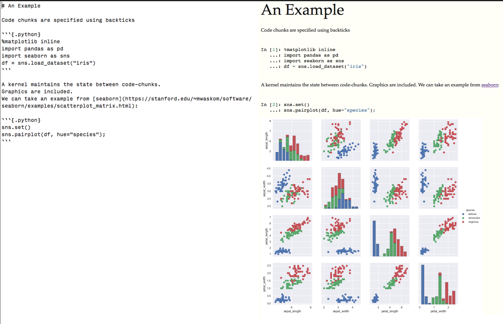

# Stitch

An experimental knitr-like library, in Python.

You should use [knitpy](https://github.com/janschulz/knitpy/) instead.
I wanted to see if there was a simpler way of doing things.

# Design

The goal was to keep `stitch` extremely simple by reusing existing libraries.
A high level overview is

1. A CLI for execution and configuration (building of traitlets)
2. Convert a Markdown document to Pandoc's JSON-based AST (using pandoc/pypandoc entirely)
3. Extract code-chunks and execute them in a Jupyter kernel (using `jupyter-client`)
4. Transform the outputs of step 3 into pandocs AST (using pandocfilters)
5. Stitch the outputs of 4 into the main document
6. Pass the new JSON AST (with outputs) into pandoc, which converts to the final output

The most lines-of-code will be devoted to steps 1, 3, and 4.

# An Example

Code chunks are specified using backticks

```{.python}
import pandas as pd
import seaborn as sns
df = sns.load_dataset("iris")
```

A kernel maintains the state between code-chunks.
Graphics are included.
We can take an example from [seaborn](https://stanford.edu/~mwaskom/software/seaborn/examples/scatterplot_matrix.html):

```{.python}
sns.set()

sns.pairplot(df, hue="species")
```



Why limit yourself to python?

```{.ir}
summary(cars)
```

```{.ir}
plot(pressure)
```
